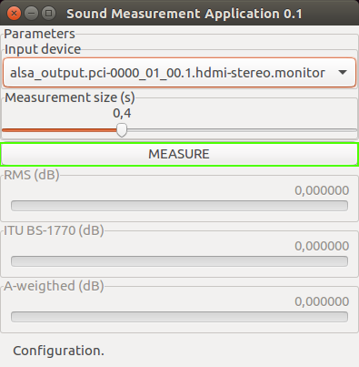

<!--- 
vim: spell:spelllang=hu
-->
---
papersize: a4
lang: hu-HU
toc: true
fontsize: 12pt
margin-left: 3.5cm
margin-top: 2.5cm
margin-bottom: 2.5cm
margin-right: 2.5cm
documentclass: report
classoption: twoside
header-includes:
    - \usepackage{setspace}
    - \onehalfspacing
---
# Bevezetés

## Motiváció

Hangosságnak nevezzük a hang azon tulajdonságát, amely halktól a hangosig skálázható.
Ez szoros összefüggésben van a hang fizikai erejével, azonban érzékelése a fülben nemcsak fizikai és fiziológiai,
hanem pszichés folyamat is.

Többen, többféleképpen értelmezik ezt a pszichoakusztikai tulajdonságát a hangnak.
Ami a különböző mérésekben azonos, hogy egytől egyig mind a logaritmikus decibel skálát használjak.
Ennek az oka az emberi hallásra vezethető vissza, egy az amplitúdójában kétszer erősebb jelet,
nem hallunk kétszer hangosabban.
Az emberi hallás átlagolja a hallott hangot 600ms és 1s között. 
Ezt a mérések is tükrözik és általában valamilyen intervallumonként átlagolt értékkel dolgoznak.

A legegyszerűbb mérés pusztán a hang fizikai tulajdonságait veszi alapul. 
Ez egy adott intervallumra vett jel négyzetes átlagának a gyökét jelenti (RMS, root mean square).

További megoldás ha a bemeneti jelet valamilyen szűrőn áteresztve értékeljük. 
A szűrőt általában kísérletezéssel állapítják meg.
Az ITU által javasolt BS-1770 az úgynevezett K-súlyozó szűrőt használja a célra.

Felismerve a tényt, hogy különböző frekvencia tartományokban a változásokra különbözően reagál a fül, 
egy lehetséges módszer a bementi jel kritikus tartományokra bontása, majd az egyes tartományok súlyozása valamilyen függvénnyel.
Ilyen függvény például az ISO 61672:2003 által előírt A-súlyozás.

Mindkét esetben a keletkezett jelből intervallumonként RMS számítunk.

## A megvalósított program

A program a fentebb említett három mérés (RMS, ITU BS-1770, és ISO 61672:2003) eredményét mutatja valós időben, 
miközben egyes részei külön-külön is felhasználhatóak és kombinálhatóak további jelfeldolgozásra a jövőben.

Jelenleg a legtöbb hangkártya 16 bites előjeles egészéket használ a bemeneti, illetve kimeneti jel ábrázolásaként.
A program, miután a jelet kiolvasta a hangkártyáról, ezt az egész számot egy 15+1 bit pontos fixpontos számnak tekinti,
majd végül belül végig 16 bit pontossággal számol. A decibel számításakor a $20\log_{10} \frac{p}{p_0}$ képletet használjuk, 
ahol $p_0 = 2^{-16}$, a legkisebb ábrázolható számot, legkisebb mérhető érték. $p$ maximális értéke elméletben
$1$, így a decibel maximális értéke jelen esetben $96.3296$ dB.

A forráskód jól elkülöníthető részei felelősek a következő funkciókért:

- bemeneti jel fogadása PulseAudio segítségével,
- generikus fixpontos számábrázolás, melynek pontosságát a felhasználó határozza meg,
- digitális szűrők megvalósítása biquad-okkal,
- low-pass, high-pass, és band-pass filterek egyszerű létrehozása,
- adott intervallumon mérések elvégzése,
- a progam felhasználói felületén a konfigurációs paraméterek és a mérések grafikus megjelenítése gtkmm-3.0 segítségével.

# Felhasználói dokumentáció

## A program üzembe helyezése

A program telepítése bármilyen operációs rendszeren lehetséges amelyen megtalálhatók az alábbi szoftverek, programkönyvtárak 
és azok függőségei:

- cmake, legalább 3.5.0,
- C++11 kompatibilis fordító, például g++ vagy clang megfelelő verziói,
- make,
- PulseAudio,
- gtkmm, 3.0 vagy annál újabb verzió a 3-as szériából.

A telepítés lépései a következőek:

1. A forrás beszerzése az internetről vagy a mellékelt hordozóról:
```
# git clone https://github.com/zleho/sma.git
```

2. Egy ideiglenes munka könyvtár létrehozása és aktívvá tétele:
```
# mkdir sma-build
# cd sma-build
```

3. CMake parancs futtatása a megfelelő paraméterekkel. A paraméterek leírása megtalálható a CMake dokumentációjában:
```
# cmake <sma-source>
```

4. A program fordítása:
```
# make
```

5. Opcionálisan a program telepítése végeleges helyére, ami CMake paraméter, aminek alap beállítása `/usr/local/`. 
Könyvtártól függően emelt privilégiumra lehet szükség a parancs kiadásánál:
```
# make install
```

## A program indítása és használata

A program az `sma` parancs kiadásával indítható. Miután a program elindult, az először csatlakozok a lokális
PulseAudio szerverhez, majd lekérdezi a lehetséges bemeneti eszközök listáját. Ezek után a program belép a konfigurációs
állapotba, ahol kiválaszthatjuk a bemeneti eszközt (1. Ábra), valamint megadhatjuk a mérési intervallum hosszát másodpercben,
$0.1$ és $1$ másodperc között (2. Ábra), tizedmásodperces lépésközzel.

{ width=300px }

{ width=300px }

Miután kiválasztottuk a nekünk megfelelő paramétereket, a konkrét mérés a `MEASURE` gombra való kattintással indítható el (3. Ábra). 
Ezek után aktiválódnak az egyes mérések és de-aktiválódnak az egyes konfigurációs lehetőségek, amíg a mérés véget nem ér.
A mérés befejezését a `MEASURE` gombra történő ismételte kattintás idézi elő. A mérések aktuális értékét a program számszerűen és
vizuálisan is mutatja (4. Ábra).

{ width=300px }

{ width=300px }

A program minden pillanatban jelzi, hogy éppen milyen állapotban van (5. Ábra).

{ width=300px }

## Mérések

### RMS

A program által elvégzett legegyszerűbb mérés az úgynevezett **root-mean-square** kalkuláció egy adott intervallumon, azaz

$$20\log_{10}\frac{\sqrt{\sum_{i=1}^{N} \frac{x_i^2}{N}}}{2^{-16}},$$

ahol $N=fT$, $T$ a mérési intervallum hossza másodpercben és $f=48000$ a mintavételezés frekvenciája és $x_i$ az $i$-ik mért jel. 

### ITU BS-1770

Az ITU által ajánlott algoritmus első két lépését hajtjuk végre, azaz

1. a bemeneti jelet $K$ frekvencia súlyozó szűrőn keresztül eresztve
2. RMS-t számolunk az intervallumon.

Az első lépés két szűrő együttese. Az első a fej akusztikáját veszi figyelembe, ahol a fej formáját tömör gömbnek veszi,
majd egy egyszerű high-pass szűrőn keresztül ereszti a jelet. A két szűrő együtthatói az ajánlásában megtalálhatóak.

### A-weighted

Az egyik leggyakrabban használt hangosság mérését elősegítő görbe az úgynevezett A-súlyozás, melyet ISO 61672:9001 és
több nemzet szabványa is a így definiál:

$$A(f)=\frac{12200^4 \cdot f^4}{(f^2 + 20.6^2) \sqrt{(f^2 + 107.7^2)(f^2 + 737.9^2)} (f^2 + 12200^2)}$$

A függvény görbéjét a 6. ábra szemlélteti.

{ width=50% }

Használatához a jelet általában oktávokra vagy harmad-oktávokra bontják, majd ezeken a kritikus sávba eső jelet
a sáv középértékén számolt súllyal számítják bele RMS-be az

$$\sum_{j=1}^K{w_j \cdot x_{ij}},$$

értékét, ahol $K$ a kritikus sávok száma és $x_{ij}$ pedig a $j$-k sávba szűrt jel.

A program 20 Hz és 20 kHz közötti sávjait és azok súlyait a 1. táblázatban találjuk meg.

| Alsó határ (Hz) | Felső határ (Hz) | Közép frekvencia (Hz) | Súly     |
|-----------------|------------------|-----------------------|----------|
| $20.0000$       | $26.6666$        | $23.3333$             | $0.0037$ |
| $26.6666$       | $33.3333$        | $30.0000$             | $0.0074$ |
| $33.3333$       | $40.0000$        | $36.6666$             | $0.0121$ |
| $40.0000$       | $53.3333$        | $46.6666$             | $0.0209$ |
| $53.3333$       | $66.6666$        | $60.0000$             | $0.0352$ |
| $66.6666$       | $80.0000$        | $73.3333$             | $0.0515$ |
| $80.0000$       | $106.666$        | $93.3333$             | $0.0783$ |
| $106.666$       | $133.333$        | $120.000$             | $0.1160$ |
| $133.333$       | $160.000$        | $146.666$             | $0.1540$ |
| $160.000$       | $213.333$        | $186.666$             | $0.2098$ |
| $213.333$       | $266.666$        | $240.000$             | $0.2800$ |
| $266.666$       | $320.000$        | $293.333$             | $0.3448$ |
| $320.000$       | $426.666$        | $373.333$             | $0.4320$ |
| $426.666$       | $533.333$        | $480.000$             | $0.5302$ |
| $533.333$       | $640.000$        | $586.666$             | $0.6099$ |
| $640.000$       | $853.333$        | $746.666$             | $0.7008$ |
| $853.333$       | $1066.66$        | $960.000$             | $0.7826$ |
| $1066.66$       | $1280.00$        | $1173.33$             | $0.8349$ |
| $1280.00$       | $1706.66$        | $1493.33$             | $0.8808$ |
| $1706.66$       | $2133.33$        | $1920.00$             | $0.9093$ |
| $2133.33$       | $2560.00$        | $2346.66$             | $0.9188$ |
| $2560.00$       | $3413.33$        | $2986.66$             | $0.9152$ |
| $3413.33$       | $4266.66$        | $3840.00$             | $0.8931$ |
| $4266.66$       | $5120.00$        | $4693.33$             | $0.8602$ |
| $5120.00$       | $6826.66$        | $5973.33$             | $0.8004$ |
| $6826.66$       | $8533.33$        | $7680.00$             | $0.7128$ |
| $8533.33$       | $10240.0$        | $9386.66$             | $0.6261$ |
| $10240.0$       | $13653.3$        | $11946.6$             | $0.5094$ |
| $13653.3$       | $17066.6$        | $15360.0$             | $0.3863$ |
| $17066.6$       | $20480.0$        | $18733.3$             | $0.2966$ |

: Harmad oktávok és azok A-súlyai

## A programkönyvtárak felhasználása

### Fixpontos aritmetika

A `fixie` névtér `Fixed` osztály sablonja a `Fixed.h` fájlban található. A példányosításhoz kettő sablon paraméterre van szükség:

- az ábrázolásra használt egész típus,
- a fix pont helye.

```c++
template <typename Int, std::size_t Q> 
struct Fixed;
```

Példányosításkor, fordítási időben a következő dolgokat ellenőriződnek:

- `std::is_integral_type<Int>`, illetve
- `Q` belefér-e `Int`-be.

Példák szabályos példányosításokra:

```c++
using fixie::Fixed;

// 1 bit előjel, 31 bit egész rész, 32 bit törtrész
using Fix16ll = Fixed<long long, 32>;

// 1 bit előjel, 0 bit egész rész, 15 bit törtrész
typedef Fixed<short, 15> Fix15s;

// 0 bit előjel, 16 bit egész rész, 16 bit törtrész
using Fix16ul = Fixed<unsigned long, 16>;
```

Tetszőleges számból kiindulva létrehozhatunk fix-pontos számot, a konstruktor elvégzi a konverziót.
A konstruktorok minden esetben explicitek, hogy elkerüljük a véletlen konverziókat.
Tetszőleges másik fix-pontos számból létrehozhatunk egy újat.
Lehetőség van a fix-pontos reprezentáció megadására is ha egész számot elváró konstruktor második paraméterével utalunk rá, 
hogy ne legyen konverzió.

```c++
auto x = Fix16ll(1);
auto y = Fix16ll(1.0);
auto z = Fix16ll(Fix15s(0.5));
auto w = Fix15s(1<<14, false); // 0.1
```

A beépített számtípusokra való visszatérés explicit típuskonverzió segítségével lehetséges.
Egész konverzió esetén a szám egész részét kapjuk meg.

```c++
auto xx = static_cast<int>(x);
auto yy = static_cast<double>(y);
```

A sablon-osztály támogatja az összes lebegőpontos számokra támogatott aritmetikai és logikai összehasonlító műveletet.
Továbbá lehetőség van fix-pontos számok $\log_2$ számítására.

### Digitális szűrők

A `BiQuad` osztály-sablon egy digitális, másodrendű rekurzív lineáris szűrő megvalósítása.
A sablon segítségével lehet meghatározni, hogy a példányosított osztály milyen számábrázolási módszerrel dolgozzon.

```c++
template <typename T>
class BiQuad;
```

Az osztály a differencia egyenletet használja:

$$y_n = b_0w_n + b_1w_{n-1} + b_2w_{n-2},$$

ahol

$$w_n = x_n - a_1w_{n-1} - a_2w_{n-2}.$$

Az $b_i$, $a_j$ konstruktor-paraméterek. Az `init()` metódussal állíthatjuk vissza a kezdeti állapotot, ahol $w_{-1} = w_{-2} = 0$.

# Fejlesztői dokumentáció

## Megvalósítási terv

### Fixpontos aritmetika

A racionális számok egy egyszerű és hatékony megvalósítása a fixpontos számábrázolás.
A fixpontos szám valamilyen skálázás után egész számként van ábrázolva a memóriában.
A skálázás mértéke függ az architcechtúrától, és általában kettőnek valamely hatványa.

Legyen $Q(m,n) \doteq \{ \frac{k}{2^n} | k \in \mathbb{Z}, k \in [-2^n,2^n-1 ] \}$ az előjeles, $n+m+1$ biten ábrázolt fixpontos számok halmaza.
Ekkor egy $q \in Q(m,n)$-nak megfelelő egész szám a memóriában a $\hat{q} = [2^nq] \in [-2^{n+m},2^{n+m-1}-1]$, ahol $[.]$ az egészrész függvény.

Ha $a,b \in Q(m,n)$, akkor

- $\widehat{a+b} \doteq \hat{a} + \hat{b}$,
- $\widehat{ab} \doteq \hat{a}\hat{b}2^{-n}$,
- $\widehat{a/b} \doteq \frac{\hat{a}2^n}{\hat{b}}$,
- $\widehat{a=b} \doteq \hat{a} = \hat{b}$,
- $\widehat{a < b} \doteq \hat{a} < \hat{b}$.

A megvalósítás feladata egy olyan adattípus sablon létrehozása amire teljesülnek a fentiek,
illetve sablon-paraméterként megadható az ábrázoláshoz használható egész típus, valamint a
fix pont helye, azaz $n$ éréke.

A osztály sablon adjon lehetőséget egyszerűen elvégezhető konverziókat más beépített számtípusokra,
valamint a többi sablon példányra.

A példányosítás nem legyen lehetséges degenerált esetekre, ezek vizsgálata fordítási időben történjen.
Minden konverzió legyen explicit.

Szükség van még $\log_2$ számításra fixpontos számokra.

Az osztály sablon felülete a felhasználó felé:

```c++
template <typename Int, std::size_t Q>
struct Fixed {
    using IntType = Int;

    constexpr auto power(); // Q
    constexpr auto denom(); // 2^Q

    IntType repr;
    
    Fixed();
    
    template <typename OtherInt> 
    explict Fixed(OtherInt);
    
    template <typename Floating> 
    explicit Fixed(Floating);

    template <typename OtherInt, std::size_t OtherSize>
    Fixed(Fixed<OtherInt, OtherSize>);

    template <typename OtherInt>
    explicit operator OtherInt();
    
    template <typename Floating>
    explicit operator Floating();

    Fixed& operator+=(Fixed);
    Fixed& operator-=(Fixed);
    Fixed& operator*=(Fixed);
    Fixed& operator/=(Fixed);

    template <typename OtherInt>
    Fixed& operator*=(OtherInt);
    
    template <typename OtherInt>
    Fixed& operator/=(OtherInt);
};

template <typename Int, std::size_t Q>
Fixed<Int, Q> operator-(Fixed<Int, Q>);

template <typename Int, std::size_t Q>
Fixed<Int, Q> operator+(Fixed<Int, Q>, Fixed<Int, Q>);

template <typename Int, std::size_t Q>
Fixed<Int, Q> operator-(Fixed<Int, Q>, Fixed<Int, Q>);

template <typename Int, std::size_t Q>
Fixed<Int, Q> operator*(Fixed<Int, Q>, Fixed<Int, Q>);

template <typename Int, std::size_t Q>
Fixed<Int, Q> operator/(Fixed<Int, Q>, Fixed<Int, Q>);

template <typename Int, std::size_t Q>
bool operator==(Fixed<Int, Q>, Fixed<Int, Q>);

template <typename Int, std::size_t Q>
bool operator!=(Fixed<Int, Q>, Fixed<Int, Q>);

template <typename Int, std::size_t Q>
bool operator==(Fixed<Int, Q>, Fixed<Int, Q>);

template <typename Int, std::size_t Q>
bool operator!=(Fixed<Int, Q>, Fixed<Int, Q>);

template <typename Int, std::size_t Q>
bool operator<(Fixed<Int, Q>, Fixed<Int, Q>);

template <typename Int, std::size_t Q>
bool operator<=(Fixed<Int, Q>, Fixed<Int, Q>);

template <typename Int, std::size_t Q>
bool operator>(Fixed<Int, Q>, Fixed<Int, Q>);

template <typename Int, std::size_t Q>
bool operator>=(Fixed<Int, Q>, Fixed<Int, Q>);

template <typename Int, std::size_t Q>
Fixed<Int, Q> log2(Fixed<Int, Q>);
```

### Digitális szűrők

BiQuad-nak nevezzük azokat a másodrendű, lineáris, rekurzív szűrőket, melyeknek kettő zérushelye és kettő szingularitása van.
Az elnevezés a bi-kvadratikus szóból ered, hiszen a $Z$ tartományban a szűrők átmenet-függvénye kettő darab másodrendű polinom hányadosa,
azaz:

$$H(z) = \frac{b_0+b_1z^{-1}+b_2z^{-2}}{a_0+a_1z^{-1}+a_2z^{-2}}$$

A függvény egyszerűbb alakja miután minden konstanst beosztottunk $a_0$-val:

$$H(z) = \frac{b_0+b_1z^{-1}+b_2z^{-2}}{1+a_1z^{-1}+a_2z^{-2}}$$

Az implementáció során többfelé differencia egyenletből is választhatunk. A legegyszerűbb eset a Direct Form I,
ahol az $a_0$-val való normalizálás után a képlet

$$y_n = b_0x_n + b_1x_{n-1} + b_2x_{n-2} - a_1y_{n-1} - a_2y_{n-2}.$$

A másik, úgynevezett Direct Form II esetén

$$y_n = b_0w_n + b_1w_{n-1} + b_2w_{n-2},$$

ahol

$$w_n = x_n - a_1w_{n-1} - a_2w_{n-2}.$$

Alapvető elvárás, hogy a megvalósítandó osztály ne függjön a számábrázolástól,
még ha az applikáció végig ugyanazt az ábrázolást használja.
A felhasználó döntése legyen az ábrázolás és a kívánt pontosság.
Az ábrázolásnál használt számtípus az osztály sablon paramétere kell, hogy legyen.
További elvárás a felület felé, hogy tetszőleges számú lépés után a belső állapota az osztálynak visszaállíthatő legyen
a kezdeti állapotra, mintha az objektum éppen abban a pillanatban lett volna létrehozva.
A függvényhívás operator segítségével imitálható, hogy az objektum tulajdonképpen egy átmenet függvényt jelképez.

A fentieknek megfelelően az osztály sablon felülete a következő:

```c++
template <typename Number>
class BiQuad {
public:
    using NumberType = Number;
    BiQuad();
    BiQuad(
        Number b0, Number b1, Number b2
        Number a1, Number a2
    );

    void init();
    Number operator()(Number x);
};
```

Az K-súlyozás kettő darab BiQuad szűrő egymás utáni alkalmazásával kapjuk a mérni kívánt jelet.
Az ITU BS-1770 ajánlás megadja a BiQuad-ok által használt konstansok értékét.

Az A-súlyozáshoz a bemeneti jelet harmadoktávokra kell bontanunk, ehhez band-szűrőkre van szükség.
A band-pass szűrők egy lehetséges implementációja egy low-pass és egy high-pass egymás utáni alkalmazása a bemeneti jelre.
Low-pass és high-pass szűrők egyik lehetséges implementációja szintén lehetséges BiQuad-kal.

Az $s$-tartományban egy másodrendű low-pass szűrő átmenet függvénye:

$$H(s) = \frac{1}{s^2 + \frac{s}{Q} + 1}.$$

Ahhoz, hogy $Z$ tartományba transzformáljuk a fenti függvényt egyrészt $s$-t ki kell fejeznünk $z$ függvényeként,
másrészt a teljes komplex teret rá kell transzformalunk a körkörös $z$ síkra.
Ha $F_c$ a low-pass frekvencia, $F_s$ pedig a minta vételezési frekvencia, akkor az így kapott transzformáció:

$$s = \frac{1}{K}\frac{z-1}{z+1},$$

ahol $K = \tan \frac{\omega T}{2}$ és $\omega T = 2 \pi \frac{F_c}{F_s}$.

Ha ezt behelyettesítjük az eredeti képletbe azt kapjuk, hogy

$$H(z) = \frac{1}{(\frac{1}{K}\frac{z-1}{z+1})^2 + \frac{\frac{1}{K}\frac{z-1}{z+1}}{Q} + 1}.$$

További egyszerűsítés és átrendezés után kapjuk, hogy

$$H(z) = \frac{K^2 + 2K^2z_{-1} + K^2z^{-2}}{(K^2 + \frac{K}{Q} + 1) + 2(K^2-1)z^{-1} + (K^2 - \frac{K}{Q} + 1)z^{-2}}.$$

Ezek után a BiQuad konstansok úgy alakulnak, hogy

$$b_0 = K^2, b_1 = 2K^2 = 2b_0, b_2 = K^2 = b_0,$$

valamint

$$a_0 = K^2 + \frac{K}{Q} + 1, a_1 = 2(K^2-1), a_2 = K^2 - \frac{K}{Q} + 1.$$.

Normalizálás után kapjuk, hogy

$$b_0 = \frac{K^2}{K^2 + \frac{K}{Q} + 1}, b_1 = 2b_0, b_2 = b_0,$$

valamint

$$a_0 = 1, a_1 = \frac{2(K^2-1)}{K^2 + \frac{K}{Q} + 1}, a_2 = \frac{K^2 - \frac{K}{Q} + 1}{K^2 + \frac{K}{Q} + 1}.$$

A szűrőhöz kapcsolódó $Q$ konstans értékének megválasztása a felhasználó feladata, Butterworth szűrők esetén az érték $\frac{1}{\sqrt{2}}$.

Mivel a konstansok kiszámítása nem a mérés közben történik, így lebegőpontos számok használata engedélyezett és pontosság miatt javallott.
A mintavételi frekvencia sablon paraméter. A megvalósítandó osztály sablon felület:

```c++
template <typename Number, std::size_t Fs>
class LowPass : public BiQuad<Number> {
public:
    LowPass(double Fc, double Q);
};
```

Hasonló levezetés során kapjuk, hogy a high-pass biquad konstansait:

$$b_0 = \frac{1}{1+\frac{K}{Q} + K^2}, b_1 = -2b_0, b_2 = b_0,$$

valamint

$$a_1 = 2\frac{K^2 -1}{1+\frac{K}{Q} + K^2}, a_2 = \frac{1- \frac{K}{Q} + K^2}{1+\frac{K}{Q} + K^2}.$$

Band-pass szűrők esetén a központi frekvenciából és a sávszélességből könnyedén meghatározható az alkamazandó
low-pass és high-pass szűrő. A osztály sablon által megvalósítandó felület:

```c++
typename <typename Number, std::size_t Fs>
class BandPass {
public:
    BandPass(double Fc, double bandWidth, double Q);
    Number operator()(Number);
};
```

### Bemeneti jel feldolgozása

A bemeneti jel feldolgozására több problémát is számba kell venni.
Egyrészt olyan mintavételi frekvenciát és számábrázolást kell találnunk,
ami támogatott a legtöbb hangkártya által. A közös pont a jelenleg,
amit a piacon lévő hangkártyák támogatnak az a 48kHz-es mintavétel
$Q(0,15)$ számábrázolással.

Másrészt olyan feldolgozási algoritmusokat kell használni amelyet a legtöbb hangkártyával
foglalkozó programozási felület támogat. Szinte minden esetben építhetünk arra,
hogy a feldolgozáshoz használt programkönyvtár a hattérben bufferel számunkra,
illetve hogy valamilyen absztrakt esemény ciklusra fűzhetjük fel az általunk
megvalósított függvényeket amik meghívódnak a nekik megfelelő események esetén.

Általában a programkönyvtárat felhasználó alkalmazás feladata, hogy a ciklusmagon egyet
iteráljon.

Szükségünk van még a lehetséges bementi eszközök listájára, hogy az alkalmazás felhasználója
eldönthesse melyik bemeneti eszközről jövő jelet szeretné az applikációval elemeztetni.

Fel kell készülni arra az esetre ha nem áll elegendő mért jelmennyiség a rendelkezésünkre
amikor az ciklus meghívja a jelfeldolgozásra biztosított függvényünket, azaz a méréseknek
képeseknek kell lennie kezelnie ha egy mérési intervallum jelmennyisége több részletben kerül
feldolgozásra és hogy a mérési periódus vége nem feltétlen esik egy a függvény végrehajtás
legvégén.

Tudni kell kezelni azokat az eseteket amikor túl sok bementi jel kerül a bufferbe
és nem az applikáció nem képes időben feldolgozni az adott jelmennyiséget.

### Mérések

Követelmény, hogy az applikáció könnyedén kiegészíthető legyen új mérésekkel.
Ehhez a méréseknek egységes felületet kell nyújtani a külvilág felé.
További elvárás, hogy ennek a felületnek le adjon hozzá a futási időhöz,
pl. ne járjon virtuális függvény hívással. Ezért a mérés sablon paramétere
legyen a mérést futtató entitásnak.

A számábrázolás, illetve annak pontossága,
valamint az egy periódusban mért jel mennyisége fordítási idejű,
azaz sablonparaméter legyen.

Mivel nem biztosítható, hogy egyszerre egy mérési intervallum összes adata
rendelkezésre áll amikor a felület megfelelő metódusa meghívásra kerül, ezért
a felületnek jeleznie kell, hogy mikor ért véget egy mérési periódus.
Ez a követelmény hatással van a mérésnél használt algoritmusokra is.

Hogy a mérési eredmény szemléltetését megkönnyítsük,
szükségünk van a mérési eredmény által felvehető maximumra is,
a minimum az összes minket érintő méréseben 0.
Természetesen ez az érték függ a felvehető minimális értéktől,
hiszen decibel alapú a skála.

A fentiek alapján a következő felülettel kell rendelkeznie az osztályoknak:

```c++
template <typename Number>
class Measurement {
public:
    static Number max();
    Measurement(std::size_t size);
    bool step(Number in, Number& out);
    void init();
};
```

Itt `Measurement` nem egy konkrét osztály, hanem egy szerződés a forráskód többi része felé.
A `step()` függvény `true`-val kell visszatérnie ha egy mérési intervallum végére érkezett,
továbbá ebben az esetben meg kell hogy hívja `init()`-et.

Minden elvégzendő mérés alapja az első mérés, azaz root-mean-square számítás.
Tulajdonképpen a többi mérés mindössze az RMS bemenetét változtatja.
Egy tetszőleges RMS-en alapuló mérésnek megfelelő osztály egy lehetséges megvalósítása:

```c++
template<typename Number>
class BasedOnRMS {
public:
    static Number max()
    { 
        return RMS<Number>::max(); 
    }
    
    BasedOnRMS(std::size_t size) : rms_(size) {}
    
    void init(); // to be defined
    bool step(Number in, Number& out)
    {
        if (step(f(in), out) {
            init();
            return true;
        }

        return false;
    }
private:
    Number f(Number x); // to be defined
    RMS<Number> rms_;
};
```

Az **root-mean-square** kalkuláció egy adott intervallumon, azaz

$$20\log_{10}\frac{\sqrt{\sum_{i=1}^{N} \frac{x_i^2}{N}}}{p_0},$$

ahol $N=fT$, $T$ a mérési intervallum hossza másodpercben,
$f$ a mintavételezés frekvenciája és $x_i$ az $i$-ik mért jel,
$p_0$ pedig a legkisebb mérhető érték abszolút értéke.

ITU mérés esetén az alkalmazás a bemeneti jelet $K$ súlyozó szűrőn keresztül eresztve RMS-t számol az intervallumon.
Az K szűrő két BiQuad szűrő együttese.

Az A-súlyozást ISO 61672:9001 és több nemzet szabványa is a így definiálja:

$$A(f)=\frac{12200^4 \cdot f^4}{(f^2 + 20.6^2) \sqrt{(f^2 + 107.7^2)(f^2 + 737.9^2)} (f^2 + 12200^2)}$$

A függvény görbéjét a 2.6. ábra szemlélteti.

A jelet harmad-oktávokra bontva band-pass szűrőkkel, a kritikus sávnak középértékén számolt súllyal összegezzük, azaz

$$\sum_{j=1}^K{w_j \cdot x_{ij}},$$

ahol $K$ a kritikus sávok száma és $x_{ij}$ pedig a $j$-k sávba szűrt jel.

Mivel a az emberi hallás 20Hz és 20kHz közé tehető, és egy oktáv emelkedés az kétszeres szorzónak felel meg a frekvenciában,
ezért 30 darab kritikus sávunk lesz.

Az ITU által megadott BiQuad konstansok 48kHz-es mintavételhez vannak megadva, 
emiatt a többi mérésnél is azt használjuk az egyszerűség kedvéért.
Továbbá ezt majd minden forgalomban lévő hangkártya egységesen támogatja.

### Felhasználói felület

A felhasználói felületet négy fő részre lehet bontani. Lehetőséget kell biztosítani a felhasználónak,
hogy kiválassz a használt bemeneti eszközt egy legördülő listából, valamint beállítsa a mérési intervallum hosszát
egy csúszkán mely egy tizedmásodperctől egy egész másodpercig terjedhet.
Ezeket a konfigurációs lehetőségeket össze kell fogni. 

Ezek alatt kel lennie a mérés elindítása és a futó mérés leállítására való gombnak.
A gomb megjelenítésének tükröznie kell az állapotát,azaz annak hogy éppen fut-e mérés vagy sem.

Közvetlenül a gomb alatt kell szemléltetni az éppen futó mérések eredményét.
Az eredménynek számszerűleg és vizuálisan jelezni kell a felhasználó felé egy úgynevezett progress bar segítségével.
A különböző mérések egymás alatt helyezkednek el.

Legalul az alkalmazás írja ki az éppen aktuális állapotát. 
A program állapotától függően legyenek a felhasználói felület más részei aktívak vagy sem.
Ha egy rész nem aktív az vizuálisan jelezni kell és az alkalmazásnak meg kell tiltania az interakciót a felhasználóval.

