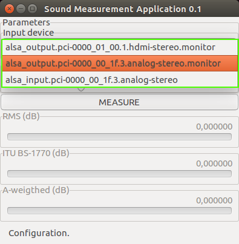

<!--- 
vim: spell:spelllang=hu
-->
---
papersize: a4
lang: hu-HU
toc: true
fontsize: 12pt
margin-left: 3.5cm
margin-top: 2.5cm
margin-bottom: 2.5cm
margin-right: 2.5cm
documentclass: report
classoption: twoside
header-includes:
    - \usepackage{setspace}
    - \onehalfspacing
---
# Bevezetés

## Motiváció

Hangosságnak nevezzük a hang azon tulajdonságát, amely halktól a hangosig skálázható.
Ez szoros összefüggésben van a hang fizikai erejével, azonban érzékelése a fülben nemcsak fizikai és fiziológiai,
hanem pszichés folyamat is.

Többen, többféleképpen értelmezik ezt a pszichoakusztikai tulajdonságát a hangnak.
Ami a különböző mérésekben azonos, hogy egytől egyig mind a logaritmikus decibel skálát használjak.
Ennek az oka az emberi hallásra vezethető vissza, egy az amplitúdójában kétszer erősebb jelet,
nem hallunk kétszer hangosabban.
Az emberi hallás átlagolja a hallott hangot 600ms és 1s között. 
Ezt a mérések is tükrözik és általában valamilyen intervallumonként átlagolt értékkel dolgoznak.

A legegyszerűbb mérés pusztán a hang fizikai tulajdonságait veszi alapul. 
Ez egy adott intervallumra vett jel négyzetes átlagának a gyökét jelenti (RMS, root mean square).

További megoldás ha a bemeneti jelet valamilyen szűrőn áteresztve értékeljük. 
A szűrőt általában kísérletezéssel állapítják meg.
Az ITU által javasolt BS-1770 az úgynevezett K-súlyozó szűrőt használja a célra.

Felismerve a tényt, hogy különböző frekvencia tartományokban a változásokra különbözően reagál a fül, 
egy lehetséges módszer a bementi jel kritikus tartományokra bontása, majd az egyes tartományok súlyozása valamilyen függvénnyel.
Ilyen függvény például az ISO 61672:2003 által előírt A-súlyozás.

Mindkét esetben a keletkezett jelből intervallumonként RMS számítunk.

## A megvalósított program

A program a fentebb említett három mérés (RMS, ITU BS-1770, és ISO 61672:2003) eredményét mutatja valós időben, 
miközben egyes részei külön-külön is felhasználhatóak és kombinálhatóak további jelfeldolgozásra a jövőben.

Jelenleg a legtöbb hangkártya 16 bites előjeles egészéket használ a bemeneti, illetve kimeneti jel ábrázolásaként.
A program, miután a jelet kiolvasta a hangkártyáról, ezt az egész számot egy 15+1 bit pontos fixpontos számnak tekinti,
majd végül belül végig 16 bit pontossággal számol. A decibel számításakor a $20\log_{10} \frac{p}{p_0}$ képletet használjuk, 
ahol $p_0 = 2^{-16}$, a legkisebb ábrázolható számot, legkisebb mérhető érték. $p$ maximális értéke elméletben
$1$, így a decibel maximális értéke jelen esetben $96.3296$ dB.

A forráskód jól elkülöníthető részei felelősek a következő funkciókért:

- bemeneti jel fogadása PulseAudio segítségével,
- generikus fixpontos számábrázolás, melynek pontosságát a felhasználó határozza meg,
- digitális szűrők megvalósítása biquad-okkal,
- low-pass, high-pass, és band-pass filterek egyszerű létrehozása,
- adott intervallumon mérések elvégzése,
- a progam felhasználói felületén a konfigurációs paraméterek és a mérések grafikus megjelenítése gtkmm-3.0 segítségével.

# Felhasználói dokumentáció

## A program üzembe helyezése

A program telepítése bármilyen operációs rendszeren lehetséges amelyen megtalálhatók az alábbi szoftverek, programkönyvtárak 
és azok függőségei:

- cmake, legalább 3.5.0,
- C++11 kompatibilis fordító, például g++ vagy clang megfelelő verziói,
- make,
- PulseAudio,
- gtkmm, 3.0 vagy annál újabb verzió a 3-as szériából.

A telepítés lépései a következőek:

1. A forrás beszerzése az internetről vagy a mellékelt hordozóról:
```
# git clone https://github.com/zleho/sma.git
```

2. Egy ideiglenes munka könyvtár létrehozása és aktívvá tétele:
```
# mkdir sma-build
# cd sma-build
```

3. CMake parancs futtatása a megfelelő paraméterekkel. A paraméterek leírása megtalálható a CMake dokumentációjában:
```
# cmake <sma-source>
```

4. A program fordítása:
```
# make
```

5. Opcionálisan a program telepítése végeleges helyére, ami CMake paraméter, aminek alap beállítása `/usr/local/`. 
Könyvtártól függően emelt privilégiumra lehet szükség a parancs kiadásánál:
```
# make install
```

## A program indítása és használata

A program az `sma` parancs kiadásával indítható. Miután a program elindult, az először csatlakozok a lokális
PulseAudio szerverhez, majd lekérdezi a lehetséges bemeneti eszközök listáját. Ezek után a program belép a konfigurációs
állapotba, ahol kiválaszthatjuk a bemeneti eszközt (1. Ábra), valamint megadhatjuk a mérési intervallum hosszát másodpercben,
$0.1$ és $1$ másodperc között (2. Ábra), tizedmásodperces lépésközzel.

{ width=300px }

{ width=300px }

Miután kiválasztottuk a nekünk megfelelő paramétereket, a konkrét mérés a `MEASURE` gombra való kattintással indítható el (3. Ábra). 
Ezek után aktiválódnak az egyes mérések és de-aktiválódnak az egyes konfigurációs lehetőségek, amíg a mérés véget nem ér.
A mérés befejezését a `MEASURE` gombra történő ismételte kattintás idézi elő. A mérések aktuális értékét a program számszerűen és
vizuálisan is mutatja (4. Ábra).

{ width=300px }

{ width=300px }

A program minden pillanatban jelzi, hogy éppen milyen állapotban van (5. Ábra).

{ width=300px }

## Mérések

### RMS

A program által elvégzett legegyszerűbb mérés az úgynevezett **root-mean-square** kalkuláció egy adott intervallumon, azaz

$$20\log_{10}\frac{\sqrt{\sum_{i=1}^{N} \frac{x_i^2}{N}}}{2^{-16}},$$

ahol $N=fT$, $T$ a mérési intervallum hossza másodpercben és $f=48000$ a mintavételezés frekvenciája és $x_i$ az $i$-ik mért jel. 

### ITU BS-1770

Az ITU által ajánlott algoritmus első két lépését hajtjuk végre, azaz
1. a bemeneti jelet $K$ frekvencia súlyozó szűrőn keresztül eresztve
2. RMS számolunk az intervallumon.

Az első lépés két szűrő együttese. Az első a fej akusztikáját veszi figyelembe, ahol a fej formáját tömör gömbnek veszi,
majd egy egyszerű high-pass szűrőn keresztül ereszti a jelet. A két szűrő együtthatói az ajánlásában megtalálhatóak.

### A-weighted

Az egyik leggyakrabban használt hangosság mérését elősegítő görbe az úgynevezett A-súlyozás, melyet ISO 61672:9001 és
több nemzet szabványa is a így definiál:

$$A(f)=\frac{12200^4 \cdot f^4}{(f^2 + 20.6^2) \sqrt{(f^2 + 107.7^2)(f^2 + 737.9^2)} (f^2 + 12200^2)}$$

A függvény görbéjét a 6. ábra szemlélteti.

{ width=50% }

Használatához a jelet általában oktávokra vagy harmad-oktávokra bontják, majd ezeken a kritikus sávba eső jelet
a sáv középértékén számolt súllyal számítják bele RMS-be az

$$\sum_{j=1}^K{w_j \cdot x_{ij}},$$

értékét, ahol $K$ a kritikus sávok száma és $x_{ij}$ pedig a $j$-k sávba szűrt jel.

A program 20 Hz és 20 kHz közötti sávjait és azok súlyait a 1. táblázatban találjuk meg.

| Alsó határ (Hz) | Felső határ (Hz) | Közép frekvencia (Hz) | Súly     |
|-----------------|------------------|-----------------------|----------|
| $20.0000$       | $26.6666$        | $23.3333$             | $0.0037$ |
| $26.6666$       | $33.3333$        | $30.0000$             | $0.0074$ |
| $33.3333$       | $40.0000$        | $36.6666$             | $0.0121$ |
| $40.0000$       | $53.3333$        | $46.6666$             | $0.0209$ |
| $53.3333$       | $66.6666$        | $60.0000$             | $0.0352$ |
| $66.6666$       | $80.0000$        | $73.3333$             | $0.0515$ |
| $80.0000$       | $106.666$        | $93.3333$             | $0.0783$ |
| $106.666$       | $133.333$        | $120.000$             | $0.1160$ |
| $133.333$       | $160.000$        | $146.666$             | $0.1540$ |
| $160.000$       | $213.333$        | $186.666$             | $0.2098$ |
| $213.333$       | $266.666$        | $240.000$             | $0.2800$ |
| $266.666$       | $320.000$        | $293.333$             | $0.3448$ |
| $320.000$       | $426.666$        | $373.333$             | $0.4320$ |
| $426.666$       | $533.333$        | $480.000$             | $0.5302$ |
| $533.333$       | $640.000$        | $586.666$             | $0.6099$ |
| $640.000$       | $853.333$        | $746.666$             | $0.7008$ |
| $853.333$       | $1066.66$        | $960.000$             | $0.7826$ |
| $1066.66$       | $1280.00$        | $1173.33$             | $0.8349$ |
| $1280.00$       | $1706.66$        | $1493.33$             | $0.8808$ |
| $1706.66$       | $2133.33$        | $1920.00$             | $0.9093$ |
| $2133.33$       | $2560.00$        | $2346.66$             | $0.9188$ |
| $2560.00$       | $3413.33$        | $2986.66$             | $0.9152$ |
| $3413.33$       | $4266.66$        | $3840.00$             | $0.8931$ |
| $4266.66$       | $5120.00$        | $4693.33$             | $0.8602$ |
| $5120.00$       | $6826.66$        | $5973.33$             | $0.8004$ |
| $6826.66$       | $8533.33$        | $7680.00$             | $0.7128$ |
| $8533.33$       | $10240.0$        | $9386.66$             | $0.6261$ |
| $10240.0$       | $13653.3$        | $11946.6$             | $0.5094$ |
| $13653.3$       | $17066.6$        | $15360.0$             | $0.3863$ |
| $17066.6$       | $20480.0$        | $18733.3$             | $0.2966$ |

: Harmad oktávok és azok A-súlyai

## A programkönyvtárak felhasználása

### Fixpontos aritmetika

A `fixie` névtér `Fixed` osztály sablonja a `Fixed.h` fájlban található. A példányosításhoz kettő sablon paraméterre van szükség:

- az ábrázolásra használt egész típus,
- a fix pont helye.

```c++
template <typename Int, std::size_t Q> 
struct Fixed;
```

Példányosításkor, fordítási időben a következő dolgokat ellenőriződnek:

- `std::is_integral_type<Int>`, illetve
- `Q` belefér-e `Int`-be.

Példák szabályos példányosításokra:

```c++
using fixie::Fixed;

// 1 bit előjel, 31 bit egész rész, 32 bit törtrész
using Fix16ll = Fixed<long long, 32>;

// 1 bit előjel, 0 bit egész rész, 15 bit törtrész
typedef Fixed<short, 15> Fix15s;

// 0 bit előjel, 16 bit egész rész, 16 bit törtrész
using Fix16ul = Fixed<unsigned long, 16>;
```

Tetszőleges számból kiindulva létrehozhatunk fix-pontos számot, a konstruktor elvégzi a konverziót.
A konstruktorok minden esetben explicitek, hogy elkerüljük a véletlen konverziókat.
Tetszőleges másik fix-pontos számból létrehozhatunk egy újat.
Lehetőség van a fix-pontos reprezentáció megadására is ha egész számot elváró konstruktor második paraméterével utalunk rá, 
hogy ne legyen konverzió.

```c++
auto x = Fix16ll(1);
auto y = Fix16ll(1.0);
auto z = Fix16ll(Fix15s(0.5));
auto w = Fix15s(1<<14, false); // 0.1
```

A beépített számtípusokra való visszatérés explicit típuskonverzió segítségével lehetséges.
Egész konverzió esetén a szám egész részét kapjuk meg.

```c++
auto xx = static_cast<int>(x);
auto yy = static_cast<double>(y);
```

A sablon-osztály támogatja az összes lebegőpontos számokra támogatott aritmetikai és logikai összehasonlító műveletet.
Továbbá lehetőség van fix-pontos számok $\log_2$ számítására.

### Digitális szűrők

A `BiQuad` osztály-sablon egy digitális, másodrendű rekurzív lineáris szűrő megvalósítása.
A sablon segítségével lehet meghatározni, hogy a példányosított osztály milyen számábrázolási módszerrel dolgozzon.

```c++
template <typename T>
class BiQuad;
```

Az osztály a differencia egyenletet használja:

$$y_n = b_0w_n + b_1w_{n-1} + b_2w_{n-2},$$

ahol

$$w_n = x_n - a_1w_{n-1} - a_2w_{n-2}.$$

Az $b_i$, $a_j$ konstruktor-paraméterek. Az `init()` metódussal állíthatjuk vissza a kezdeti állapotot, ahol $w_{-1} = w_{-2} = 0$.

# Fejlesztői dokumentáció

## Megvalósítási terv

Lorem ipsum dolor sit amet, duo modus quidam consequat an. Alii vocibus intellegat ut duo. Eos ex melius aeterno vivendo, posse doming reformidans id vel. In tale mundi sea. Ex mea assum tincidunt efficiantur. Option pertinax ex sea, ferri malis phaedrum nam no.

## Megvalósítás

Lorem ipsum dolor sit amet, duo modus quidam consequat an. Alii vocibus intellegat ut duo. Eos ex melius aeterno vivendo, posse doming reformidans id vel. In tale mundi sea. Ex mea assum tincidunt efficiantur. Option pertinax ex sea, ferri malis phaedrum nam no.

## Tesztelés

Lorem ipsum dolor sit amet, duo modus quidam consequat an. Alii vocibus intellegat ut duo. Eos ex melius aeterno vivendo, posse doming reformidans id vel. In tale mundi sea. Ex mea assum tincidunt efficiantur. Option pertinax ex sea, ferri malis phaedrum nam no.


